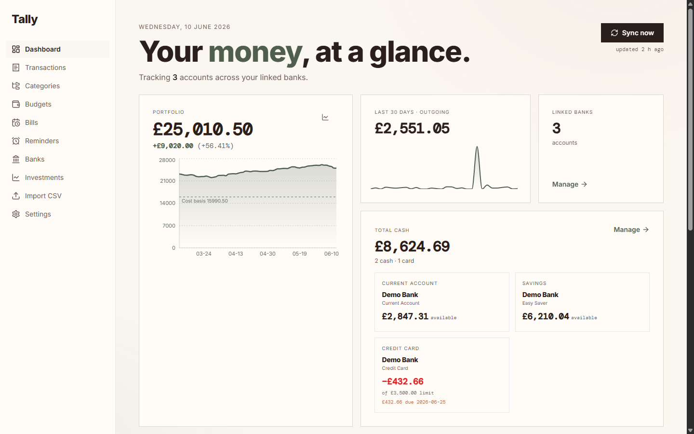
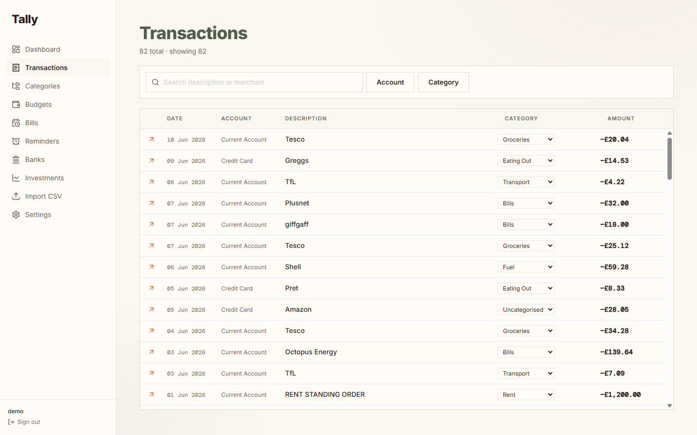
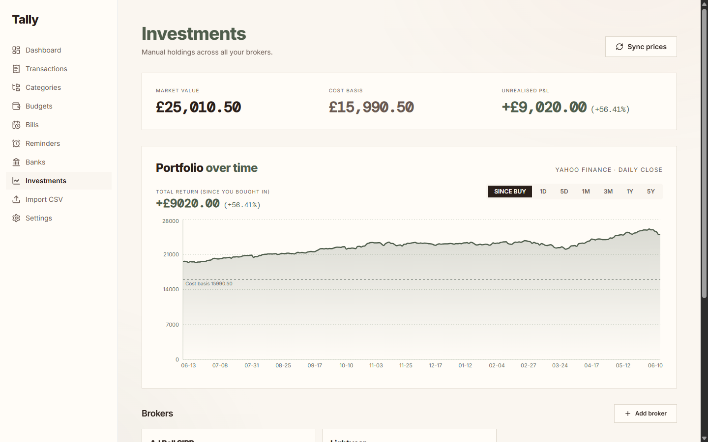
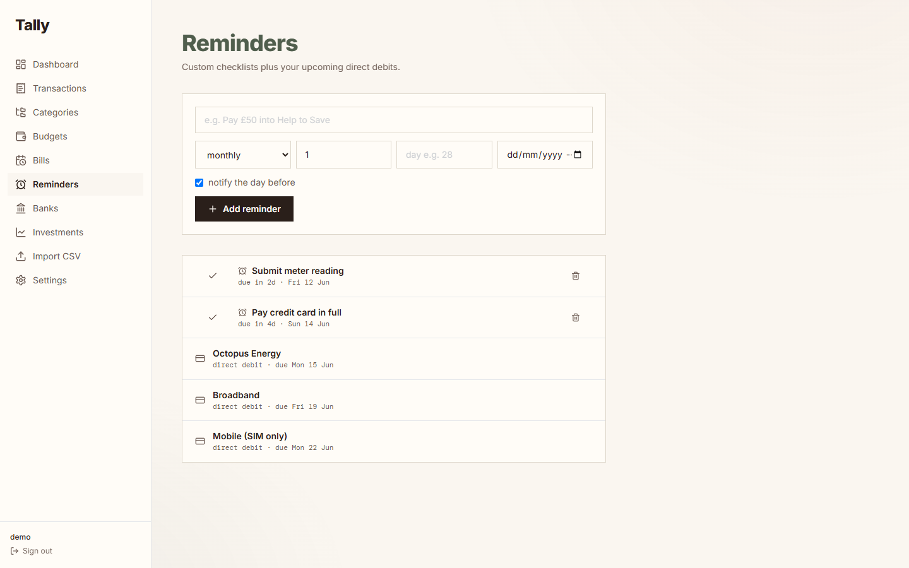

# tally

Self-hosted personal finance for UK Open Banking. Rust (axum) backend, React frontend, one
Docker container, SQLite storage with secrets encrypted at rest. It includes an MCP server so AI
assistants can read your finances in near real-time, and built-in 2FA.

**[You can one-click deploy it for free to Google Cloud →](#deploy-to-google-cloud-run-one-click)**

## What it does

- Syncs UK bank accounts through TrueLayer. Multi-bank with a single OAuth callback URL.
- Stores every transaction locally in SQLite, not just references.
- Rules engine (regex to category), budgets, bills, and search/aggregate APIs.
- Tracks investment holdings and net worth.
- Custom recurring reminders and checklists (e.g. Help to Save, card due dates) with Telegram
  alerts, shown alongside your auto-detected direct debits.
- Exposes an MCP server so Claude, ChatGPT, and similar clients can query your data and read or
  tick reminders.
- Has its own auth: first-run setup, Argon2id passwords, and TOTP 2FA with recovery codes.

## Screenshots

All data below is fake demo data.



| Transactions | Investments |
|---|---|
|  |  |

| Reminders and direct debits | |
|---|---|
|  | |

## Before you expose it publicly

tally aggregates your bank data, so treat it like a sensitive internal app. tally has its own
login and TOTP 2FA, but if it will be reachable from the internet we strongly recommend a
zero-trust access layer in front of it as well. The easiest option is Cloudflare Zero Trust
(Cloudflare Access) on your domain; an identity provider with forward-auth (Authentik, Authelia,
Keycloak) works the same way.

Gate the web UI, and leave only the paths that machines need reachable: `/mcp`,
`/.well-known/*`, and `/auth/callback` (the bank redirect). tally protects `/mcp` itself by
validating OIDC tokens, so bypassing the access layer on those paths does not leave them open.
If Claude or another MCP client connects but never shows any tally tools, this is the first
thing to check: the access layer is almost certainly intercepting `/mcp` or `/.well-known/*`
with a login redirect that the client cannot follow.

You do not have to rely on that layer alone. tally also protects itself: Argon2id password
hashing, TOTP 2FA with single-use codes, per-IP login rate limiting with lockout, ChaCha20-Poly1305
encryption of tokens at rest, and standard security headers. Run it behind a TLS reverse proxy and
set `TALLY_SECURE_COOKIES=true`.

## Requirements

- Docker and Docker Compose.
- A TrueLayer Live application (client id and secret) from console.truelayer.com.
- For the MCP connector, an OIDC provider that issues access tokens (Authentik, Keycloak, Auth0,
  and so on). tally validates those tokens; it does not run its own OAuth server.

## Quickstart

```bash
git clone https://github.com/mthwjsmith/tally.git
cd tally
cp apps/api/.env.example .env
# set TALLY_MASTER_KEY  (openssl rand -base64 32)
# set TALLY_TRUELAYER_CLIENT_ID and TALLY_TRUELAYER_CLIENT_SECRET
docker compose up -d --build
# open http://localhost:3001, create the first user, enrol 2FA, then add a bank
```

The container binds to `127.0.0.1:3001` by default. For remote access, front it with a TLS reverse
proxy (and the zero-trust layer above).

## Deploy to Google Cloud Run (one-click)

[](https://console.cloud.google.com/cloudshell/editor?shellonly=true&cloudshell_image=gcr.io/cloudrun/button&cloudshell_git_repo=https://github.com/mthwjsmith/tally.git)

Builds and deploys tally to your own Google Cloud account. You will be prompted for a few values
(defined in `app.json`):

- `TALLY_MASTER_KEY` (required) — a secure random value is generated for you; just accept it.
- `TALLY_TRUELAYER_CLIENT_ID` / `_SECRET` (required) — your TrueLayer Live app credentials.
- **Everything else: just press Enter.** The two TrueLayer values are the only things you need to
  type. Accept the default database (it's ephemeral — fine for a test), and leave the Turso token,
  redirect URI, and OIDC fields blank for now. You can set them later for a persistent/real deploy.

For a quick test you can stop there — it deploys, you log in, and click around (data resets on cold
start). To make it durable and link real banks, see the persistence and redirect-URI notes below.

**Data persistence.** Cloud Run has no persistent disk, so the default `file:` database is wiped on
every cold start — fine for a quick test (create a user, click around). For data that survives,
create a free [Turso](https://turso.tech) database and set `TALLY_DATABASE_URL=libsql://YOUR-DB.turso.io`
plus `TALLY_DATABASE_AUTH_TOKEN`.

**After the first deploy.** Copy the `https://YOUR-SERVICE.run.app` URL, set `TALLY_REDIRECT_URI_BASE`
to `<that URL>/auth`, add the same callback to your TrueLayer app's redirect URIs, and redeploy —
needed before you can link a bank.

**Add a zero-trust gate (recommended).** The button deploys the service publicly; tally's own Argon2 +
TOTP login still protects it, but for a stronger gate enable Google **Identity-Aware Proxy** — a
one-click toggle on the Cloud Run service (no load balancer, no extra cost) that puts a Google sign-in
in front. The deploy button can't set IAP itself, so do it after: Cloud Run → your service →
**Security** → enable **Identity-Aware Proxy**, then grant yourself the **IAP-secured Web App User**
role. Note: IAP gates the human web UI but is not compatible with the headless `/mcp` AI connector —
on an IAP deployment, leave `/mcp` disabled (unset `TALLY_OIDC_*`) or front it with Cloudflare Access.

## Configuration

Full list is in `apps/api/.env.example`. The ones you usually need:

| Variable | Purpose |
|----------|---------|
| `TALLY_MASTER_KEY` | 32-byte base64 key that encrypts tokens at rest (required) |
| `TALLY_TRUELAYER_CLIENT_ID` / `_SECRET` | TrueLayer Live credentials (required) |
| `TALLY_DATABASE_URL` | `file:/path/state.db` (default, local) or `libsql://…turso.io` for hosted Turso (then set `TALLY_DATABASE_AUTH_TOKEN`) |
| `TALLY_ENABLE_REMINDERS` | `true` (default) runs reminders/Telegram/sync; set `false` on serverless |
| `TALLY_REDIRECT_URI_BASE` | Public base URL TrueLayer redirects back to |
| `TALLY_OIDC_ISSUER` / `TALLY_OIDC_AUDIENCE` | External OIDC provider for the MCP connector |
| `TALLY_SECURE_COOKIES` | Set to `true` when served over HTTPS |
| `TALLY_TRUST_PROXY` | Set to `true` only behind a trusted reverse proxy (rate-limit keys then use `X-Forwarded-For`) |

## MCP connector

`/mcp` accepts access tokens issued by your OIDC provider and validates them against the
provider's JWKS (signature, issuer, audience, expiry). Read tools accept any valid token; write
tools (recording an investment, adding or ticking a reminder) require a token with the `write`
scope. There are two ways to provide the OIDC side.

### Option A: Cloudflare Access Managed OAuth (nothing extra to run)

If tally already sits behind Cloudflare, you do not need to host your own identity provider.
In Cloudflare Zero Trust, create a self-hosted Access application covering your tally hostname's
`/mcp` path, enable **Managed OAuth** in its advanced settings, add an Allow policy for yourself,
and copy the application's AUD tag. Then set:

```
TALLY_OIDC_ISSUER=https://<your-team>.cloudflareaccess.com
TALLY_OIDC_AUDIENCE=<the Access application AUD tag>
TALLY_OIDC_JWKS_URL=https://<your-team>.cloudflareaccess.com/cdn-cgi/access/certs
```

Cloudflare runs the OAuth flow for claude.ai and forwards each request with a
`Cf-Access-Jwt-Assertion` JWT, which tally validates like any other OIDC token. Cloudflare's
tokens carry no `write` scope, so this path is read-only.

### Option B: your own OIDC provider

Create an OAuth2/OIDC application in your provider (Authentik, Keycloak, Auth0, and so on), set
`TALLY_OIDC_ISSUER` and `TALLY_OIDC_AUDIENCE` to match, then add the connector in your AI client.
A ready-to-run Authentik stack is included (note: it is too heavy for small hosts like a 2 GB Pi;
run it on a bigger box or use Option A):

```bash
docker compose -f docker-compose.yml -f docker-compose.idp.yml up -d
```

## Reminders

Reminders are recurring checklist items (hourly, daily, weekly, or monthly on a fixed day of the
month). tally pings you on Telegram when one is due and not ticked, then rolls it to the next
period. The screen also shows your auto-detected direct debits, so it is one place for everything
you owe or need to do.

## Build from source

- Backend: Rust stable, then `cargo build --release` in `apps/api`.
- Frontend: Node 22, then `npm install` and `npm run build` in `apps/web`.

The Dockerfile builds both stages and bundles the built SPA into the binary's static directory.

## Security reporting

See `SECURITY.md`. Use private vulnerability reporting rather than public issues.

## License

MIT. See `LICENSE`.
